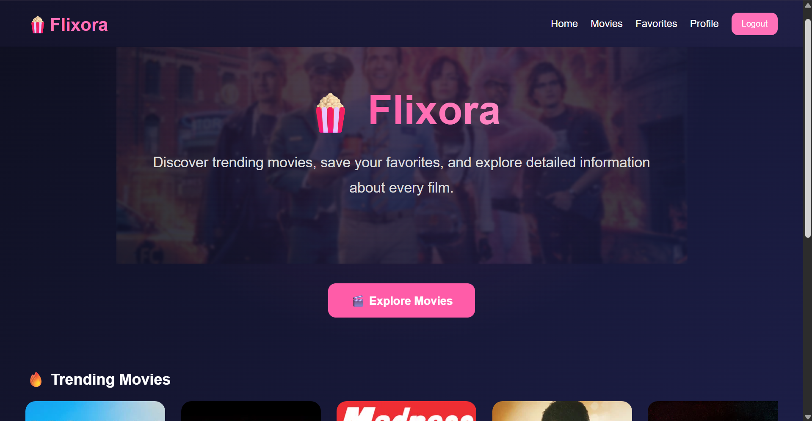
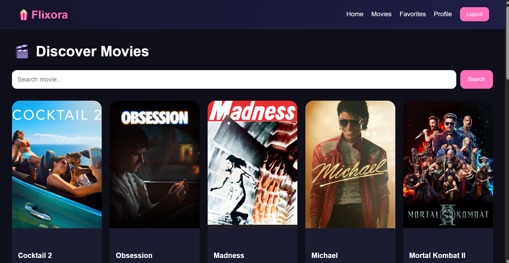
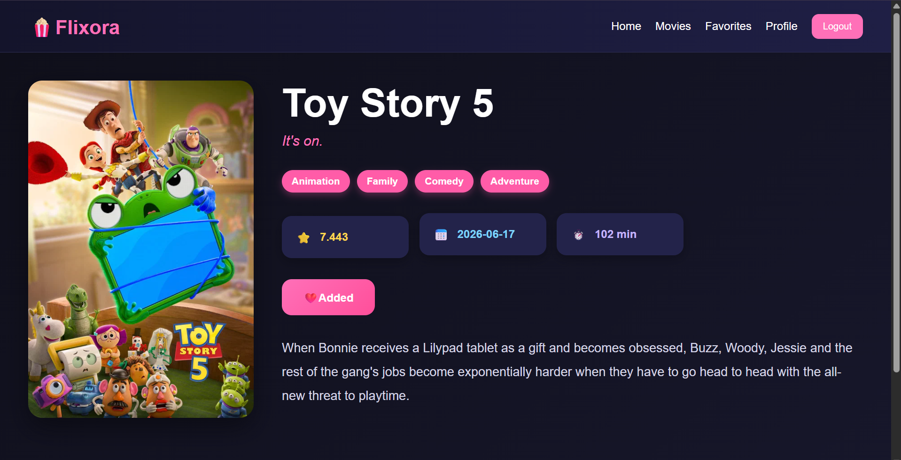
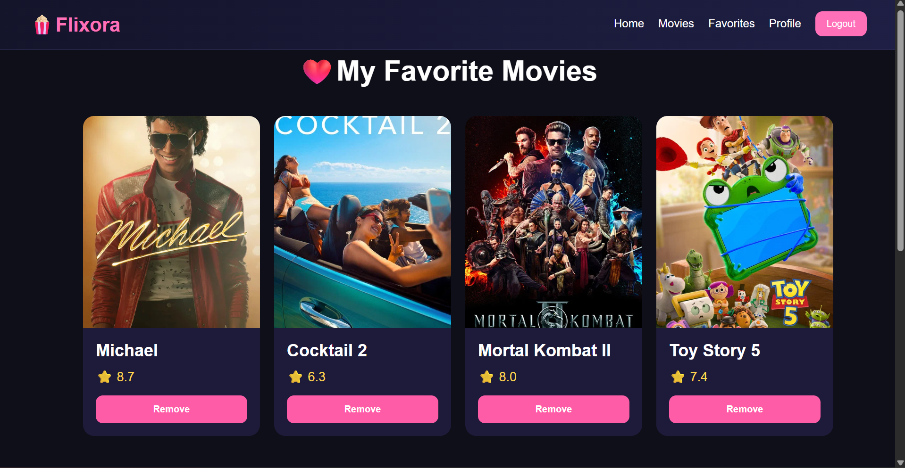
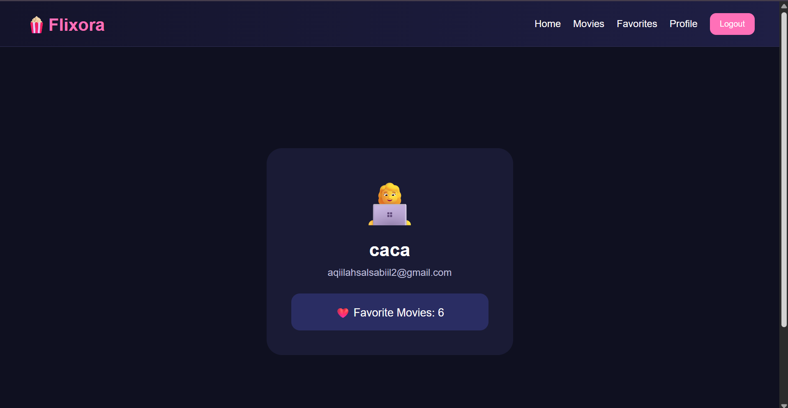
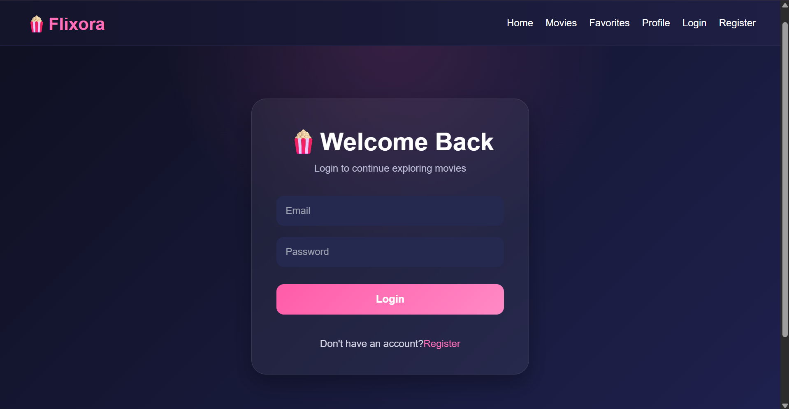
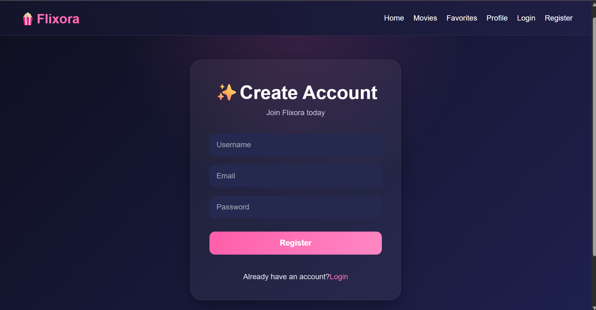

# 🍿 Flixora

Flixora adalah aplikasi web pencarian film yang dibangun menggunakan **React + Vite** dan memanfaatkan **TMDB API** sebagai sumber data film. Aplikasi ini memungkinkan pengguna untuk mencari film, melihat informasi lengkap, serta menyimpan film favorit.

---

## 📌 Fitur

- 🔐 Register dan Login
- 🏠 Halaman Home dengan Hero Section
- 🔥 Menampilkan Trending Movies
- 🎬 Menampilkan daftar film populer
- 🔍 Pencarian film berdasarkan judul
- 🎭 Menampilkan genre film
- 📄 Halaman detail film
- ❤️ Menambahkan dan menghapus film favorit
- 👤 Halaman profil pengguna
- 🚫 Halaman 404 (Not Found)
- 🔔 Notifikasi menggunakan React Toastify
- 💾 Penyimpanan data favorit menggunakan Local Storage
- 📱 Tampilan responsif

---

## 🛠️ Teknologi yang Digunakan

- React
- Vite
- React Router DOM
- Fetch API
- TMDB API
- React Toastify
- CSS3
- Local Storage

---

## 📷 Tampilan Aplikasi

### 🏠 Home


### 🎬 Movies


### 📄 Detail Movie


### ❤️ Favorites


### 👤 Profile


### Login


### Register



## 📂 Struktur Folder

```
src
│
├── assets
├── components
├── context
├── pages
├── services
├── App.jsx
└── main.jsx
```

---

## 🚀 Cara Menjalankan Project

### 1. Clone Repository

```bash
git clone https://github.com/salsablqlh/Flixora
```

### 2. Masuk ke Folder Project

```bash
cd flixora
```

### 3. Install Dependency

```bash
npm install
```

### 4. Buat File `.env`

```env
VITE_TMDB_API_KEY=4afd7fdd067c84fd36ff557054903fbe
```

### 5. Jalankan Project

```bash
npm run dev
```

---

## 🌐 Demo

Aplikasi dapat diakses melalui:

https://flixora-eosin.vercel.app/

---

## 👩‍💻 Pengembang

**Salsabiil Aqiilah**

GitHub : https://github.com/salsablqlh

---

## 📝 Lisensi

Project ini dibuat untuk memenuhi project capstone open recruitment neotelemetri 2026